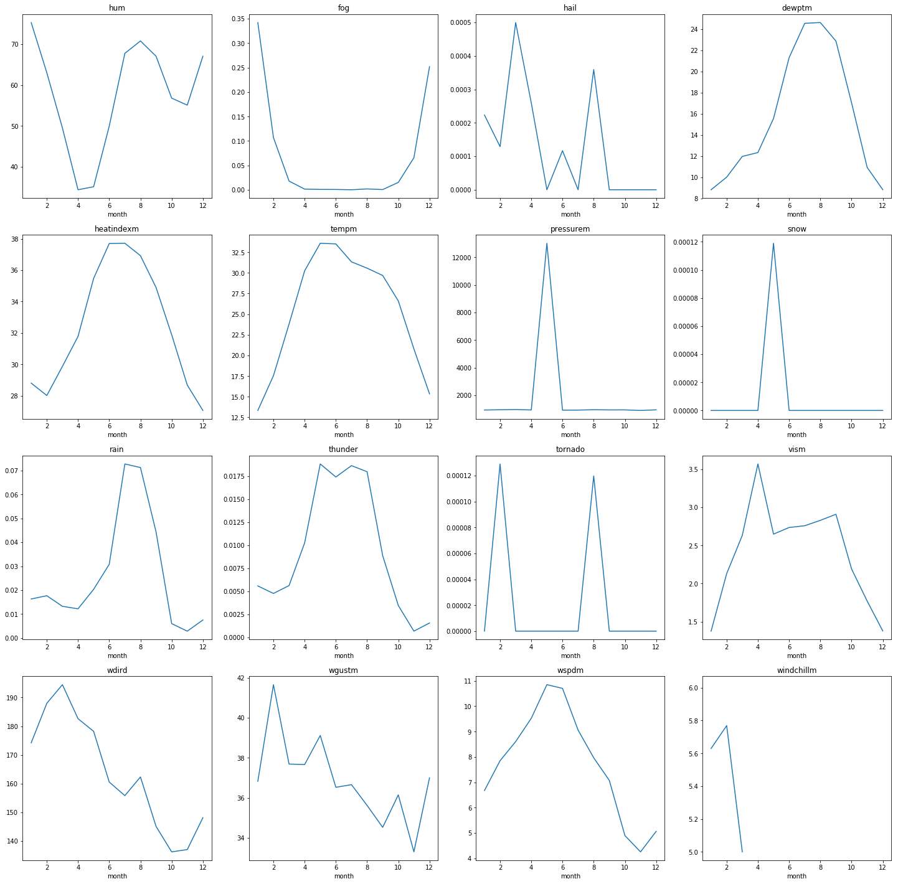
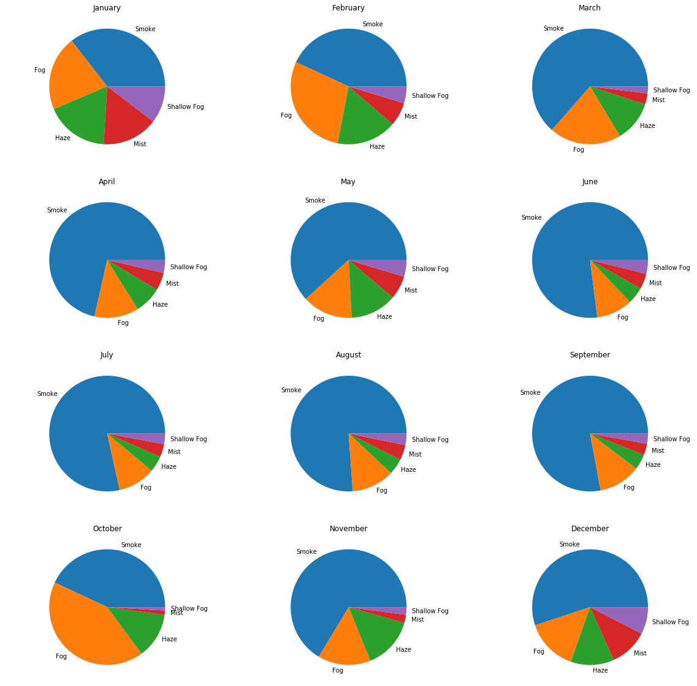

```python
import pandas as pd
import matplotlib.pyplot as plt
import datetime as dt
```


```python
data = pd.read_csv("testset1.csv",parse_dates=['datetime_utc'])
# data.info()
```


```python
data.fillna(0,inplace=True)
```


```python
data['Date'] = pd.to_datetime(data['datetime_utc'])
data['year'] = data['Date'].dt.year
data['month'] = data['Date'].dt.month
data['day'] = data['Date'].dt.day
data['hour'] = data['Date'].dt.hour
```

<h2>Line plot for different features like rain, snow, hail</h2>


```python
month_mean = data.groupby('month').mean()

fig, axes = plt.subplots(nrows=4, ncols=4,figsize=(25,25))

month_mean.hum.plot(ax=axes[0,0],title='hum')
month_mean.fog.plot(ax=axes[0,1],title='fog')
month_mean.hail.plot(ax=axes[0,2],title='hail')
month_mean.dewptm.plot(ax=axes[0,3],title='dewptm')
month_mean.heatindexm .plot(ax=axes[1,0],title='heatindexm')
month_mean.tempm .plot(ax=axes[1,1],title='tempm')
month_mean.pressurem.plot(ax=axes[1,2],title='pressurem')
month_mean.snow.plot(ax=axes[1,3],title='snow')
month_mean.rain.plot(ax=axes[2,0],title='rain')
month_mean.thunder.plot(ax=axes[2,1],title='thunder')
month_mean.tornado.plot(ax=axes[2,2],title='tornado')
month_mean.vism.plot(ax=axes[2,3],title='vism')
month_mean.wdird.plot(ax=axes[3,0],title='wdird')
month_mean.wgustm.plot(ax=axes[3,1],title='wgustm')
month_mean.wspdm.plot(ax=axes[3,2],title='wspdm')
month_mean.windchillm.plot(ax=axes[3,3],title='windchillm')

```


    <matplotlib.axes._subplots.AxesSubplot at 0x1e7e23ab9b0>





<h2>  pie charts for different weather conditions in a month</h2>


```python
data2 = data.query("month == '1'")[['month','conds']].groupby('conds').count().reset_index().sort_values('month',ascending =False).head(5)
```


```python

plt.figure(figsize=(20,20))

plt.subplot2grid((4,3),(0,0))
data2 = data.query("month == '1'")[['month','conds']].groupby('conds').count().reset_index().sort_values('month',ascending =False).head(5)
plt.title("January")
plt.axis("equal")
plt.pie(data2.month,labels=data4.conds,radius=1)

plt.subplot2grid((4,3),(0,1))
data2 = data.query("month == '2'")[['month','conds']].groupby('conds').count().reset_index().sort_values('month',ascending =False).head(5)
plt.title("February")
plt.axis("equal")
plt.pie(data2.month,labels=data4.conds,radius=1)

plt.subplot2grid((4,3),(0,2))
data2 = data.query("month == '3'")[['month','conds']].groupby('conds').count().reset_index().sort_values('month',ascending =False).head(5)
plt.title("March")
plt.axis("equal")
plt.pie(data2.month,labels=data4.conds,radius=1)


plt.subplot2grid((4,3),(1,0))
data2 = data.query("month == '4'")[['month','conds']].groupby('conds').count().reset_index().sort_values('month',ascending =False).head(5)
plt.title("April")
plt.axis("equal")
plt.pie(data2.month,labels=data4.conds,radius=1)


plt.subplot2grid((4,3),(1,1))
data2 = data.query("month == '5'")[['month','conds']].groupby('conds').count().reset_index().sort_values('month',ascending =False).head(5)
plt.title("May")
plt.axis("equal")
plt.pie(data2.month,labels=data4.conds,radius=1)


plt.subplot2grid((4,3),(1,2))
data2 = data.query("month == '6'")[['month','conds']].groupby('conds').count().reset_index().sort_values('month',ascending =False).head(5)
plt.title("June")
plt.axis("equal")
plt.pie(data2.month,labels=data4.conds,radius=1)


plt.subplot2grid((4,3),(2,0))
data2 = data.query("month == '7'")[['month','conds']].groupby('conds').count().reset_index().sort_values('month',ascending =False).head(5)
plt.title("July")
plt.axis("equal")
plt.pie(data2.month,labels=data4.conds,radius=1)


plt.subplot2grid((4,3),(2,1))
data2 = data.query("month == '8'")[['month','conds']].groupby('conds').count().reset_index().sort_values('month',ascending =False).head(5)
plt.title("August")
plt.axis("equal")
plt.pie(data2.month,labels=data4.conds,radius=1)


plt.subplot2grid((4,3),(2,2))
data2 = data.query("month == '9'")[['month','conds']].groupby('conds').count().reset_index().sort_values('month',ascending =False).head(5)
plt.title("September")
plt.axis("equal")
plt.pie(data2.month,labels=data4.conds,radius=1)


plt.subplot2grid((4,3),(3,0))
data2 = data.query("month == '10'")[['month','conds']].groupby('conds').count().reset_index().sort_values('month',ascending =False).head(5)
plt.title("October")
plt.axis("equal")
plt.pie(data2.month,labels=data4.conds,radius=1)


plt.subplot2grid((4,3),(3,1))
data2 = data.query("month == '11'")[['month','conds']].groupby('conds').count().reset_index().sort_values('month',ascending =False).head(5)
plt.title("November")
plt.axis("equal")
plt.pie(data2.month,labels=data4.conds,radius=1)


plt.subplot2grid((4,3),(3,2))
data2 = data.query("month == '12'")[['month','conds']].groupby('conds').count().reset_index().sort_values('month',ascending =False).head(5)
plt.title("December")
plt.axis("equal")
plt.pie(data2.month,labels=data4.conds,radius=1)


plt.show()
```




